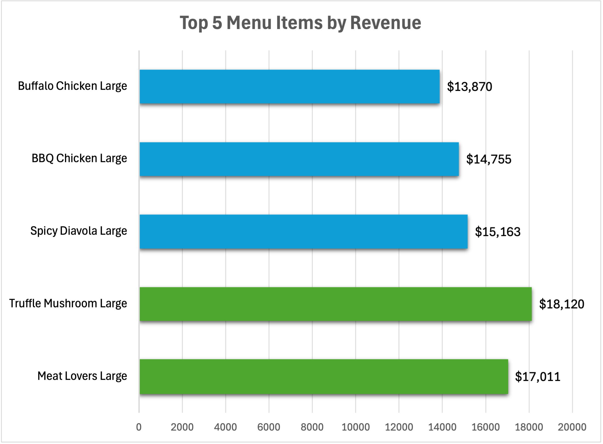
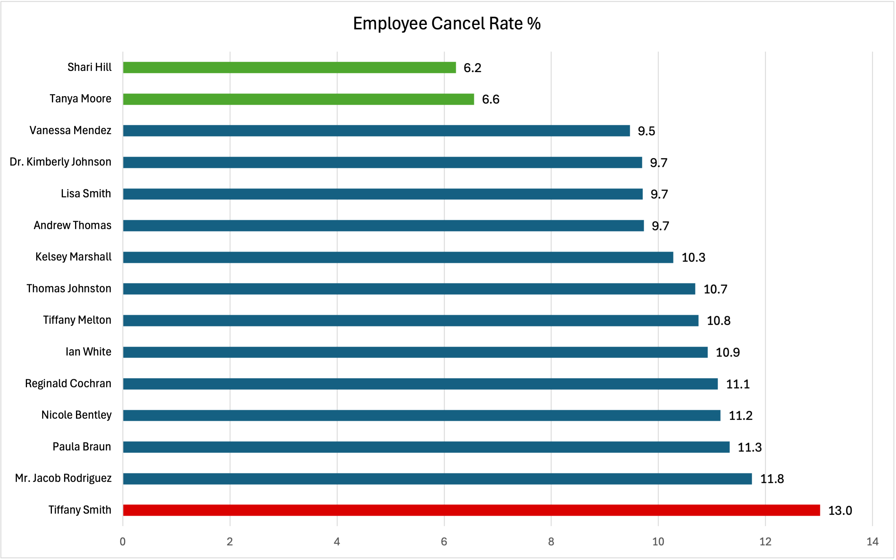

# Restaurant Operations & Revenue Analytics
### End-to-End SQL + Python + Excel

---

## Executive Summary

Designed and implemented a 9-table normalized relational database simulating 15 months of restaurant operations, cleaning 7,000+ synthetic transaction records in Python and engineering 12 SQL analytical queries across revenue, menu performance, operations, and customer dimensions. Key findings include a 20x growth in monthly order volume over 11 months, a revenue-volume divergence in menu performance where the highest-priced item outearned the most-ordered item, and a 2x spread in employee cancel rates pointing to measurable performance gaps.

---

## Business Problem

Small independent restaurants manage orders, customers, payments, and deliveries across disconnected systems. Without a centralized data environment it becomes difficult to reliably answer core operational questions — which menu items drive the most revenue, when peak demand occurs, which customers are most valuable, and where operational inefficiencies exist. This project builds a relational database and analytical layer to answer those questions from structured transactional data.

---

## Methodology

**1. Database Design**
Designed a 9-table normalized relational schema covering customers, employees, orders, pizzas, toppings, payments, and deliveries. Applied normalization, defined primary and foreign key constraints, and resolved many-to-many relationships through bridge tables (`PIZZA_TOPPING`, `PIZZA_ORDER`).

**2. Data Generation**
Generated 7,000+ synthetic orders spanning January 2025 to April 2026 using Python and Faker, with realistic business patterns — weekend volume spikes, lunch and dinner peaks, a 20% regular customer cohort driving 50% of orders, and a business growth trend over time. Intentional data quality issues were introduced across all 9 tables to simulate real-world messy data.

**3. Data Cleaning (`data_cleaning_pipeline.ipynb`)**
Resolved data quality issues across all 9 tables before loading into MySQL:
- Standardized name casing and stripped whitespace across string columns
- Unified 5 different phone number formats to raw 10-digit strings using regex
- Resolved 6 near-duplicate customer records via Name + Address deduplication
- Collapsed 351 duplicate order line items by summing quantities
- Standardized 12 status variations down to 4 canonical values using title casing and a typo correction map
- Converted date and time columns from object to proper datetime types

**4. SQL Analysis (`analysis_queries.sql`)**
Wrote 12 analytical queries using the cleaned MySQL database including:
- Revenue aggregation and monthly trend analysis
- Peak demand by hour and day of week
- Menu performance by volume and revenue with cross-comparison
- Employee cancel rate benchmarking
- Customer value segmentation

**5. Visualization (`dashboard.xlsx`)**
Built an 8-chart Excel dashboard from exported query results covering revenue trends, menu performance, and customer analysis.

---

## Results and Recommendations

**Revenue**
- Restaurant generated **$185,817** in revenue across **4,817 delivered orders** over 15 months with an average order value of **$38.58**
- Monthly order volume grew **20x** from January 2025 (29 orders) to November 2025 (614 orders), while average order value remained stable at ~$38-40 — indicating growth driven by customer acquisition rather than increased spend per order

  

**Peak Demand**
- Two daily peaks identified across all days: **lunch (11am–1pm)** and **dinner (5pm–10pm)**, with a consistent dead zone between 2pm–4pm
- **Friday and Saturday are peak revenue days** at $31,588 and $31,895 respectively — Thursday shows the lowest weekday revenue at $22,315, presenting a targeted promotion opportunity to pull forward weekend demand

**Menu Performance**
- **Truffle Mushroom Large** generates the highest revenue at **$18,120** while also ranking second in units sold (824), driven by its $21.99 price point — premium specialty items contribute more to revenue relative to order frequency
- **Gluten Free Veggie** appears in both bottom 5 lists by volume and revenue across two sizes — a strong candidate for menu removal
- All top 5 revenue items are Large size — inventory planning should prioritize large size availability

**Employee Performance**
- Store average cancel rate: **10.14%**
- **Tiffany Smith** shows the highest cancel rate at **13.02%**, approximately 28% above the store average
- **Shari Hill (6.22%)** and **Tanya Moore (6.56%)** perform significantly below the average cancel rate — best practices from these employees are worth identifying and replicating
- Recommend management check which employees are scheduled on high cancel rate days to determine if staffing is a factor

  
**Customers**
- **Jacob Riddle** is the highest value customer at **$4,208 total spend** across 104 orders over 15 months — approximately one order every 4-5 days
- Two of the top 10 customers by spend have incomplete contact information - the restuarant has no way to contact them for promotions
---

## Skills and Tools

| Category | Details |
|---|---|
| **SQL** | INNER JOIN, LEFT JOIN, GROUP BY, ORDER BY, CASE WHEN, subqueries, DATE_FORMAT, DAYNAME, HOUR, DATEDIFF |
| **Python** | pandas, numpy |
| **Database Design** | ERD design, normalization, primary keys, foreign keys, bridge tables, referential integrity |
| **Data Cleaning** | Deduplication, type conversion, regex standardization, null flagging, mismatch detection |
| **Excel** | clustered bar charts, line charts, pie charts, conditional formatting |

---

## Limitations and Next Steps

**Limitations**
- Dataset is synthetic — patterns reflect generation methodology and do not represent a real business. Findings are illustrative of analytical approach rather than real operational insights
- No cost data available — profitability and margin analysis not possible without ingredient, labor, and overhead costs
- Repeat customer rate of 100% is an artifact of data generation with only 120 customers and 7,000 orders — not reflective of realistic churn behavior
- Shift schedule data not available — employee cancel rate analysis cannot be cross-referenced with staffing patterns

**Next Steps**
- Integrate cost data to enable margin analysis and true profitability ranking by menu item
- Extend schema to include an inventory table tracking ingredient usage per order
